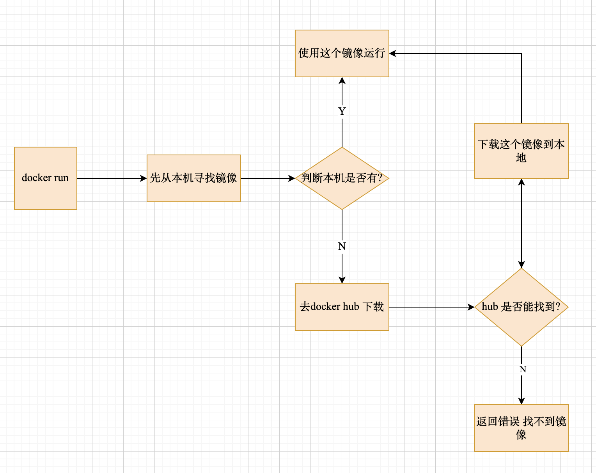
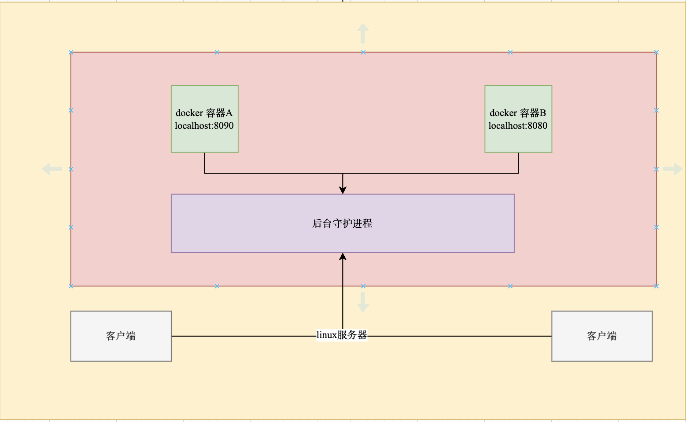

# Docker

## 底层原理

### Docker run




### Docker是怎么工作的

Docker是一个Client - Server结构系统, Docker的守护进程运行在主机上, 通过Socket从客户端访问.

DockerServer接受到Docker-Client command, 就会执行command.




### Dokcer为什么比VM快

- docker比vm更少的抽象层.
- docker利用宿主机内核, vm需要Guest OS.


## 常用命令

### 帮助

```shell
docker version  			#docker version 

docker info     			#显示docker系统信息, 包括镜像跟容器的数量

docker command --help	#帮助命令
```


### 镜像

docker images	查看本地主机所有镜像

```shell
REPOSITORY                                      TAG       IMAGE ID       CREATED        SIZE
jaegertracing/all-in-one                        latest    a39ccdfc9f98   3 days ago     57.6MB

#解释
REPOSITORY 	镜像仓库源
TAG				 	镜像标签
IMAGE ID   	镜像Id
CREATED			镜像创建时间
SIZE 				镜像大小

#可选项
-a, --all    列出所有镜像
-q, --quiet  只显示镜像Id      
```


docker search	搜索镜像

```shell
NAME                             DESCRIPTION                                     STARS     OFFICIAL   AUTOMATED
mysql                            MySQL is a widely used, open-source relation…   12283     [OK]

#可选项
-f, --filter=STARS=3000  搜索出来的Stars>3000

```


dokcer pull 下载镜像

```shell
#docker pull [镜像:tag]
Using default tag: latest   #如果不写tag默认就是latest(最新版本)
latest: Pulling from library/php
ae13dd578326: Pull complete #分层下载. docker image核心 联合文件系统
f15d475049bf: Pull complete
886e5161983f: Pull complete
aa7666573a25: Pull complete
1a6aac8da418: Pull complete
5b13992bc13b: Pull complete
5180d2980215: Pull complete
659c0f9be91b: Pull complete
420b30ed548a: Pull complete
Digest: sha256:f6b2a36adaf6ea1d57829cea61eb5d4baacf2da41d635fe191ab098ee86c7661	#签名
Status: Downloaded newer image for php:latest
docker.io/library/php:latest	#真实地址
```


docker rmi 删除镜像

```shell
docker rmi -f 镜像id								 #删除指定镜像Id

docker rmi -f 镜像id 镜像id 镜像id	  #删除多个镜像

docker rmi -f $(docker images -aq)  #删除全部镜像
```


### 容器

docker run 新建容器启动

```shell
docker run [可选参数] image

#可选参数
--name="Name"   #容器名字
-d							#后台运行 
-it  						#使用交互方式运行, 进入容器查看内容
-P							#指定容器端口
                #-P ip:主机端口:容器端口
                #-P 主机端口:容器端口
                #-P 容器端口
                #容器端口
                
-p							#随机指定端口


```


docker ps 列出所有运行容器

```shell
docker ps     	#当前正在运行的容器

docker ps -a  	#包含历史运行过容器 

docker ps -n=?  #显示最近创建的容器

docker ps -q    #只显示容器Id
```


docker rm  删除容器

```shell
docker rm 容器id  							#删除指定容器,不能删除正在运行的容器,如果要强制删除 rm -f

docker rm -f $(docker ps -aq)	 #删除所有的容器

docker ps -a -q|xargs rm 			 #删除所有的容器
```


启动停止容器

```shell
docker start 容器id    				#启动容器

docker restart 容器id	 				#重启容器

docker stop 容器id		 				#停止当前正在运行容器

docker kill 容器id		 				#强制停止当前

#$(docker ps -aq) 所有容器
```


### 其他

